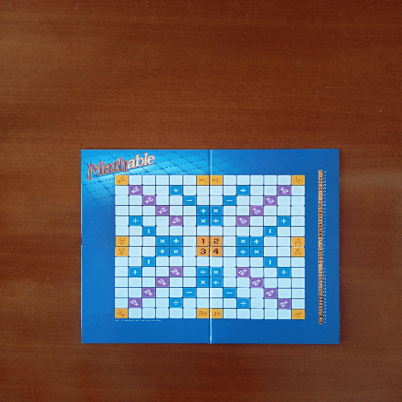

# Board Game Piece Detection and Recognition using Template Matching

This project implements a complete computer vision pipeline for detecting and recognizing pieces on a board game from sequential images of the gameplay.  
The recognition step is performed using **OpenCV Template Matching**, ensuring that each detected piece is compared against a set of predefined reference images.

## Project Description

The workflow begins by processing a game image to locate and extract the board.  
The board is detected through contour analysis and a perspective transformation is applied to obtain a perfect square view.  
After cropping away irrelevant borders, the board is resized and divided into individual squares.

When a new image is processed, the algorithm detects which square has changed compared to the previous image. The contents of that square are isolated, cleaned using morphological operations, and matched against stored templates of known pieces.

The **`cv.matchTemplate`** function with `cv.TM_SQDIFF_NORMED` is used to measure similarity between the detected piece and each template, selecting the closest match.  
This process is repeated for all moves in the game, updating the internal board state and calculating scores based on game rules.

## How It Works

1. **Board Detection**  
   - Convert image to HSV, mask out irrelevant regions.
   - Find the largest contour and extract its corners.
   - Apply a perspective transformation for a top-down view.
   - Remove margins and resize to standard dimensions.

2. **Piece Template Preparation**  
   - From reference images of the board, crop all known pieces.
   - Save them in organized folders, each corresponding to a specific piece index.

3. **Move Detection**  
   - Compare the current board image to the previous one.
   - Identify the square that has changed the most (based on mean pixel difference).

4. **Piece Recognition via Template Matching**  
   - Clean the extracted square using thresholding, blurring, and edge detection.
   - Compare the result against relevant templates using `cv.matchTemplate`.
   - Select the template with the lowest difference score.

5. **Score Calculation**  
   - Based on the recognized piece index and game rules (operators and multipliers from the predefined map), update the score.

## Usage

1. Install dependencies:
   ```bash
   pip install opencv-python numpy
   ```
2. Prepare the `imagini_auxiliare/` folder with reference board images and the `testare/` folder with gameplay frames and turn files.
3. Run the main script:
   ```bash
   python main.py
   ```
4. Output:
   - Individual text files for each detected move (`<game>_<move>.txt`).
   - Score files summarizing the results (`<game>_scores.txt`).

## Demonstration

```
[]
```

## Notes

- Accuracy depends heavily on lighting conditions and template quality.
- Templates should be captured from the same perspective and lighting as the test images for best results.

--- 
